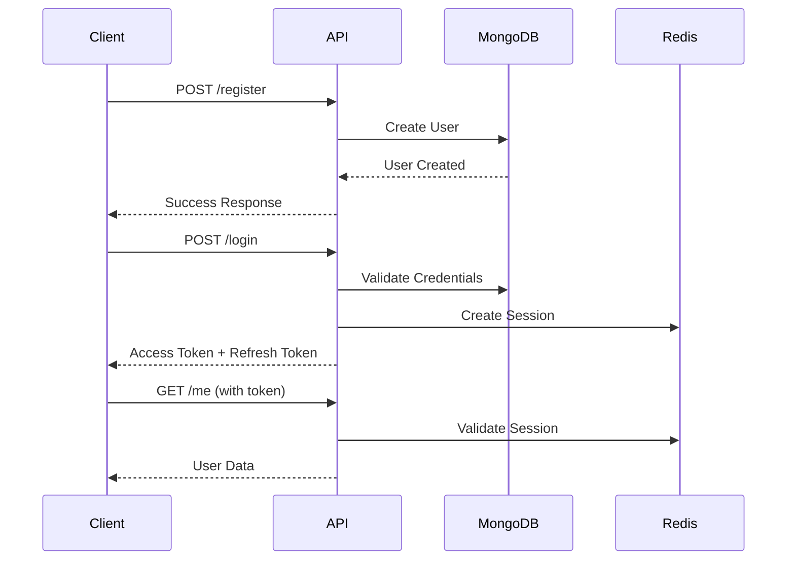

# Full Stack Authentication API Documentation

## Table of Contents
- [Overview](#overview)
- [Base Configuration](#base-configuration)
- [Authentication Flow](#authentication-flow)
- [API Endpoints](#api-endpoints)
- [Frontend Integration](#frontend-integration)
- [Error Handling](#error-handling)
- [Security Best Practices](#security-best-practices)
- [Rate Limiting](#rate-limiting)
- [Testing Guide](#testing-guide)

## Overview

This is a comprehensive authentication API built with Node.js, Express, MongoDB, and Redis. It provides secure user authentication, session management, device tracking, and password reset functionality.

### Key Features
- JWT-based authentication with refresh tokens
- Session management with Redis
- Device tracking and management
- Rate limiting and security middleware
- Password reset via email
- Comprehensive error handling
- Account lockout protection

## Base Configuration

```
Base URL: http://localhost:9000
API Prefix: /api/auth
Health Check: /health
```

### Environment Variables
```env
PORT=9000
NODE_ENV=development
MONGODB_URI=mongodb://localhost:27017/secure-auth-full-stack
REDIS_URL=redis://localhost:6379
JWT_SECRET=your-super-secret-jwt-key
JWT_REFRESH_SECRET=your-super-secret-refresh-key
JWT_EXPIRE=15m
JWT_REFRESH_EXPIRE=7d
SESSION_TIMEOUT=300
MAX_LOGIN_ATTEMPTS=5
LOCKOUT_TIME=900
```

## Authentication Flow

### 1. User Registration → Login → Protected Routes



## API Endpoints

### 1. Health Check

Check if the server is running and healthy.

**Endpoint:** `GET /health`

**Headers:** None

**Response:**
```json
{
  "status": "healthy",
  "message": "Server is running",
  "timestamp": "2025-07-20T08:30:00.000Z",
  "environment": "development"
}
```

**Frontend Usage:**
```javascript
// Check server health before app initialization
const checkServerHealth = async () => {
  try {
    const response = await fetch('http://localhost:9000/health');
    const data = await response.json();
    
    if (data.status === 'healthy') {
      console.log('Server is healthy');
      return true;
    }
  } catch (error) {
    console.error('Server health check failed:', error);
    return false;
  }
};
```

---

### 2. User Registration

Register a new user account.

**Endpoint:** `POST /api/auth/register`

**Headers:**
```
Content-Type: application/json
```

**Request Body:**
```json
{
  "email": "user@example.com",
  "password": "SecurePass123!",
  "firstName": "John",
  "lastName": "Doe"
}
```

**Validation Rules:**
- Email: Valid email format, normalized
- Password: Min 8 chars, must contain uppercase, lowercase, number, special char
- FirstName: 2-50 chars, letters only
- LastName: 2-50 chars, letters only

**Success Response (201):**
```json
{
  "success": true,
  "message": "User registered successfully",
  "user": {
    "id": "507f1f77bcf86cd799439011",
    "email": "user@example.com",
    "firstName": "John",
    "lastName": "Doe",
    "createdAt": "2025-07-20T08:30:00.000Z",
    "isActive": true
  }
}
```

**Error Response (409 - Conflict):**
```json
{
  "success": false,
  "status": "error",
  "error": {
    "statusCode": 409,
    "status": "error"
  },
  "message": "User already exists with this email"
}
```

**Frontend Implementation:**
```javascript
// Registration Form Handler
const registerUser = async (userData) => {
  try {
    const response = await fetch('http://localhost:9000/api/auth/register', {
      method: 'POST',
      headers: {
        'Content-Type': 'application/json',
      },
      body: JSON.stringify(userData)
    });

    const data = await response.json();

    if (data.success) {
      // Show success message
      showNotification('Registration successful! Please login.', 'success');
      // Redirect to login page
      navigate('/login');
    } else {
      // Handle validation errors
      displayErrors(data.message);
    }
  } catch (error) {
    console.error('Registration error:', error);
    showNotification('Registration failed. Please try again.', 'error');
  }
};

// React Hook Example
const useRegistration = () => {
  const [loading, setLoading] = useState(false);
  const [errors, setErrors] = useState({});

  const register = async (formData) => {
    setLoading(true);
    setErrors({});

    try {
      const response = await fetch('/api/auth/register', {
        method: 'POST',
        headers: { 'Content-Type': 'application/json' },
        body: JSON.stringify(formData)
      });

      const data = await response.json();

      if (!data.success) {
        setErrors({ general: data.message });
        return false;
      }

      return true;
    } catch (error) {
      setErrors({ general: 'Network error. Please try again.' });
      return false;
    } finally {
      setLoading(false);
    }
  };

  return { register, loading, errors };
};
```

---

### 3. User Login

Authenticate user and create session with **single-device enforcement**. This endpoint automatically logs out all other active sessions when a user logs in from any device.

**Endpoint:** `POST /api/auth/login`

**Headers:**
```
Content-Type: application/json
User-Agent: Your-App/1.0 (Platform)
```

**Request Body:**
```json
{
  "email": "user@example.com",
  "password": "SecurePass123!",
  "deviceToken": "optional-push-notification-token"
}
```

#### Success Responses

**First Login or Same Device (200):**
```json
{
  "success": true,
  "message": "Login successful",
  "accessToken": "eyJhbGciOiJIUzI1NiIsInR5cCI6IkpXVCJ9...",
  "refreshToken": "eyJhbGciOiJIUzI1NiIsInR5cCI6IkpXVCJ9...",
  "user": {
    "id": "507f1f77bcf86cd799439011",
    "email": "user@example.com",
    "firstName": "John",
    "lastName": "Doe",
    "lastLogin": "2025-07-20T08:30:00.000Z",
    "isActive": true
  },
  "deviceInfo": {
    "deviceId": "device_abc123_chrome_windows",
    "isNewDevice": false,
    "totalDevices": 1
  }
}
```

**Login from Different Device with Automatic Logout (200):**
```json
{
  "success": true,
  "message": "Login successful",
  "accessToken": "eyJhbGciOiJIUzI1NiIsInR5cCI6IkpXVCJ9...",
  "refreshToken": "eyJhbGciOiJIUzI1NiIsInR5cCI6IkpXVCJ9...",
  "user": {
    "id": "507f1f77bcf86cd799439011",
    "email": "user@example.com",
    "firstName": "John",
    "lastName": "Doe",
    "lastLogin": "2025-07-20T08:30:00.000Z",
    "isActive": true
  },
  "deviceInfo": {
    "deviceId": "device_def456_firefox_macos",
    "isNewDevice": true,
    "totalDevices": 2
  },
  "deviceLogout": {
    "wasLoggedOut": true,
    "previousDevice": {
      "browser": "Chrome",
      "os": "Windows",
      "deviceType": "desktop",
      "deviceId": "device_abc123_chrome_windows",
      "lastSeen": "2025-07-20T07:15:00.000Z"
    },
    "message": "You have been automatically logged out from your previous device/browser."
  }
}
```

**Error Responses:**

*Invalid Credentials (401):*
```json
{
  "success": false,
  "status": "error",
  "error": {
    "statusCode": 401,
    "status": "error"
  },
  "message": "Invalid credentials. 4 attempts remaining."
}
```

*Account Locked (429):*
```json
{
  "success": false,
  "status": "error",
  "error": {
    "statusCode": 429,
    "status": "error"
  },
  "message": "Account locked due to multiple failed attempts. Please try again in 15 minutes."
}
```

#### Single-Device Login Behavior

**Important:** This API enforces a strict single-device login policy. When a user logs in:

1. **All existing sessions are invalidated** - Any active sessions on other devices are immediately terminated
2. **All refresh tokens are revoked** - Previous refresh tokens become invalid
3. **Device information is captured** - Browser, OS, IP, and device fingerprint are recorded
4. **Previous device details are returned** - If logging out from other devices, details are provided in the response

**Device Logout Response Fields:**

| Field | Type | Description |
|-------|------|-------------|
| `deviceLogout.wasLoggedOut` | boolean | `true` if user was logged out from other devices |
| `deviceLogout.previousDevice.browser` | string | Browser name (e.g., "Chrome", "Firefox") |
| `deviceLogout.previousDevice.os` | string | Operating system (e.g., "Windows", "macOS") |
| `deviceLogout.previousDevice.deviceType` | string | Device type ("desktop", "mobile", "tablet") |
| `deviceLogout.previousDevice.deviceId` | string | Unique device identifier |
| `deviceLogout.previousDevice.lastSeen` | string | ISO timestamp of last activity |
| `deviceLogout.message` | string | Human-readable security message |

**Security Implications:**
- Users will receive immediate feedback about device security events
- Previous sessions cannot be used after a new login occurs
- API clients should handle `deviceLogout` responses appropriately
- Frontend should display security notifications to users

**Frontend Implementation:**
```javascript
// Login Service with Token Management
class AuthService {
  constructor() {
    this.baseURL = 'http://localhost:9000/api/auth';
    this.accessToken = localStorage.getItem('accessToken');
    this.refreshToken = localStorage.getItem('refreshToken');
  }

  async login(credentials) {
    try {
      const response = await fetch(`${this.baseURL}/login`, {
        method: 'POST',
        headers: {
          'Content-Type': 'application/json',
          'User-Agent': `MyApp/1.0 (${navigator.platform})`
        },
        body: JSON.stringify({
          ...credentials,
          deviceToken: await this.getDeviceToken() // For push notifications
        })
      });

      const data = await response.json();

      if (data.success) {
        // Store tokens securely
        this.setTokens(data.accessToken, data.refreshToken);
        
        // Store user data
        localStorage.setItem('user', JSON.stringify(data.user));
        
        // Handle device logout notification
        if (data.deviceLogout?.wasLoggedOut) {
          this.showDeviceLogoutNotification(data.deviceLogout);
        }

        return { success: true, user: data.user };
      } else {
        return { success: false, message: data.message };
      }
    } catch (error) {
      console.error('Login error:', error);
      return { success: false, message: 'Network error. Please try again.' };
    }
  }

  setTokens(accessToken, refreshToken) {
    this.accessToken = accessToken;
    this.refreshToken = refreshToken;
    localStorage.setItem('accessToken', accessToken);
    localStorage.setItem('refreshToken', refreshToken);
  }

  async getDeviceToken() {
    // Implement push notification token retrieval
    // This depends on your push notification service (FCM, etc.)
    return null;
  }

  showDeviceLogoutNotification(logoutInfo) {
    const message = `You were logged out from your ${logoutInfo.previousDevice.deviceType} (${logoutInfo.previousDevice.browser})`;
    // Show notification to user
    this.showNotification(message, 'info');
  }
}

// React Hook for Login
const useAuth = () => {
  const [user, setUser] = useState(null);
  const [loading, setLoading] = useState(false);
  const [error, setError] = useState(null);

  const login = async (credentials) => {
    setLoading(true);
    setError(null);

    const authService = new AuthService();
    const result = await authService.login(credentials);

    if (result.success) {
      setUser(result.user);
      // Redirect or update app state
    } else {
      setError(result.message);
    }

    setLoading(false);
    return result.success;
  };

  const logout = async () => {
    // Call logout endpoint
    await fetch('/api/auth/logout', {
      method: 'POST',
      headers: {
        'Authorization': `Bearer ${localStorage.getItem('accessToken')}`
      }
    });

    // Clear local state
    setUser(null);
    localStorage.removeItem('accessToken');
    localStorage.removeItem('refreshToken');
    localStorage.removeItem('user');
  };

  return { user, login, logout, loading, error };
};

// Complete React Login Component with Device Logout Alerts
const Login = () => {
  const [formData, setFormData] = useState({ email: '', password: '' });
  const [deviceLogoutInfo, setDeviceLogoutInfo] = useState(null);
  const [countdown, setCountdown] = useState(5);
  const { login, loading, error } = useAuth();
  const navigate = useNavigate();

  // Countdown effect for device logout alerts
  useEffect(() => {
    let interval;
    if (deviceLogoutInfo) {
      interval = setInterval(() => {
        setCountdown(prev => {
          if (prev <= 1) {
            navigate('/dashboard');
            return 0;
          }
          return prev - 1;
        });
      }, 1000);
    }
    return () => clearInterval(interval);
  }, [deviceLogoutInfo, navigate]);

  const handleSubmit = async (e) => {
    e.preventDefault();
    try {
      const response = await login(formData);
      
      if (response.success) {
        // Check for device logout information
        if (response.deviceLogout?.wasLoggedOut) {
          setDeviceLogoutInfo(response.deviceLogout);
          setCountdown(5); // Reset countdown
        } else {
          navigate('/dashboard');
        }
      }
    } catch (error) {
      console.error('Login failed:', error);
    }
  };

  return (
    <div className="login-container">
      {/* Device Logout Alert */}
      {deviceLogoutInfo && (
        <div className="alert alert-info">
          <h4>✅ Login Successful!</h4>
          <p><strong>🔒 Device Security Notice:</strong></p>
          <p>{deviceLogoutInfo.message}</p>
          <div className="device-details">
            <strong>Previous Device:</strong> {deviceLogoutInfo.previousDevice.browser} on {deviceLogoutInfo.previousDevice.os}<br/>
            <strong>Device Type:</strong> {deviceLogoutInfo.previousDevice.deviceType}<br/>
            <strong>Last Seen:</strong> {new Date(deviceLogoutInfo.previousDevice.lastSeen).toLocaleString()}
          </div>
          <div className="countdown">
            🚀 Redirecting to dashboard in {countdown} second{countdown !== 1 ? 's' : ''}...
            <div className="progress-bar">
              <div style={{ width: `${(countdown / 5) * 100}%` }}></div>
            </div>
          </div>
        </div>
      )}

      {/* Login Form */}
      <form onSubmit={handleSubmit}>
        <input
          type="email"
          value={formData.email}
          onChange={(e) => setFormData({...formData, email: e.target.value})}
          placeholder="Email"
          required
        />
        <input
          type="password"
          value={formData.password}
          onChange={(e) => setFormData({...formData, password: e.target.value})}
          placeholder="Password"
          required
        />
        <button type="submit" disabled={loading}>
          {loading ? 'Signing In...' : 'Sign In'}
        </button>
      </form>
    </div>
  );
};
```

---

### 4. Get User Profile

Retrieve current user's profile information.

**Endpoint:** `GET /api/auth/me`

**Headers:**
```
Authorization: Bearer <access_token>
```

**Success Response (200):**
```json
{
  "success": true,
  "user": {
    "id": "507f1f77bcf86cd799439011",
    "email": "user@example.com",
    "firstName": "John",
    "lastName": "Doe",
    "createdAt": "2025-07-20T08:30:00.000Z",
    "lastLogin": "2025-07-20T08:30:00.000Z",
    "isActive": true
  }
}
```

**Frontend Implementation:**
```javascript
// Get User Profile
const getUserProfile = async () => {
  try {
    const response = await fetch('/api/auth/me', {
      headers: {
        'Authorization': `Bearer ${localStorage.getItem('accessToken')}`
      }
    });

    if (response.status === 401) {
      // Token expired, try to refresh
      const refreshed = await refreshAccessToken();
      if (refreshed) {
        return getUserProfile(); // Retry with new token
      } else {
        // Redirect to login
        redirectToLogin();
        return null;
      }
    }

    const data = await response.json();
    return data.success ? data.user : null;
  } catch (error) {
    console.error('Get profile error:', error);
    return null;
  }
};

// React Component Example
const UserProfile = () => {
  const [user, setUser] = useState(null);
  const [loading, setLoading] = useState(true);

  useEffect(() => {
    const fetchProfile = async () => {
      const userData = await getUserProfile();
      setUser(userData);
      setLoading(false);
    };

    fetchProfile();
  }, []);

  if (loading) return <div>Loading...</div>;
  if (!user) return <div>Error loading profile</div>;

  return (
    <div className="user-profile">
      <h2>Welcome, {user.firstName} {user.lastName}</h2>
      <p>Email: {user.email}</p>
      <p>Member since: {new Date(user.createdAt).toLocaleDateString()}</p>
      <p>Last login: {new Date(user.lastLogin).toLocaleString()}</p>
    </div>
  );
};
```

---

### 5. Session Management

#### Get Session Status

**Endpoint:** `GET /api/auth/session-status`

**Headers:**
```
Authorization: Bearer <access_token>
```

**Response:**
```json
{
  "success": true,
  "timeLeft": 285,
  "sessionId": "session_123456789"
}
```

#### Extend Session

**Endpoint:** `POST /api/auth/extend-session`

**Headers:**
```
Authorization: Bearer <access_token>
```

**Response:**
```json
{
  "success": true,
  "message": "Session extended successfully"
}
```

**Frontend Implementation:**
```javascript
// Session Management Service
class SessionManager {
  constructor() {
    this.warningShown = false;
    this.checkInterval = null;
  }

  startSessionMonitoring() {
    // Check session status every minute
    this.checkInterval = setInterval(async () => {
      await this.checkSessionStatus();
    }, 60000);
  }

  async checkSessionStatus() {
    try {
      const response = await fetch('/api/auth/session-status', {
        headers: {
          'Authorization': `Bearer ${localStorage.getItem('accessToken')}`
        }
      });

      const data = await response.json();

      if (data.success) {
        const timeLeft = data.timeLeft;

        // Show warning at 60 seconds
        if (timeLeft <= 60 && !this.warningShown) {
          this.showSessionWarning(timeLeft);
          this.warningShown = true;
        }

        // Auto-extend if user is active
        if (timeLeft <= 30 && this.isUserActive()) {
          await this.extendSession();
          this.warningShown = false;
        }
      }
    } catch (error) {
      console.error('Session check error:', error);
    }
  }

  async extendSession() {
    try {
      const response = await fetch('/api/auth/extend-session', {
        method: 'POST',
        headers: {
          'Authorization': `Bearer ${localStorage.getItem('accessToken')}`
        }
      });

      const data = await response.json();
      if (data.success) {
        console.log('Session extended');
        this.warningShown = false;
      }
    } catch (error) {
      console.error('Session extend error:', error);
    }
  }

  isUserActive() {
    // Check for recent user activity (mouse movement, key press, etc.)
    return Date.now() - this.lastActivityTime < 300000; // 5 minutes
  }

  showSessionWarning(timeLeft) {
    // Show modal or notification
    const modal = document.createElement('div');
    modal.innerHTML = `
      <div class="session-warning-modal">
        <p>Your session will expire in ${timeLeft} seconds.</p>
        <button onclick="this.closest('.session-warning-modal').remove(); sessionManager.extendSession()">
          Extend Session
        </button>
        <button onclick="window.location.href='/login'">
          Logout
        </button>
      </div>
    `;
    document.body.appendChild(modal);
  }

  stopSessionMonitoring() {
    if (this.checkInterval) {
      clearInterval(this.checkInterval);
    }
  }
}

// Usage
const sessionManager = new SessionManager();
sessionManager.startSessionMonitoring();
```

---

### 6. Change Password

Change user's password (requires current password).

**Endpoint:** `POST /api/auth/change-password`

**Headers:**
```
Authorization: Bearer <access_token>
Content-Type: application/json
```

**Request Body:**
```json
{
  "currentPassword": "OldPassword123!",
  "newPassword": "NewPassword123!"
}
```

**Success Response (200):**
```json
{
  "success": true,
  "message": "Password changed successfully. Please log in again."
}
```

**Frontend Implementation:**
```javascript
// Password Change Component
const ChangePasswordForm = () => {
  const [formData, setFormData] = useState({
    currentPassword: '',
    newPassword: '',
    confirmPassword: ''
  });
  const [loading, setLoading] = useState(false);
  const [errors, setErrors] = useState({});

  const validateForm = () => {
    const newErrors = {};

    if (formData.newPassword.length < 8) {
      newErrors.newPassword = 'Password must be at least 8 characters';
    }

    if (formData.newPassword !== formData.confirmPassword) {
      newErrors.confirmPassword = 'Passwords do not match';
    }

    setErrors(newErrors);
    return Object.keys(newErrors).length === 0;
  };

  const handleSubmit = async (e) => {
    e.preventDefault();

    if (!validateForm()) return;

    setLoading(true);

    try {
      const response = await fetch('/api/auth/change-password', {
        method: 'POST',
        headers: {
          'Content-Type': 'application/json',
          'Authorization': `Bearer ${localStorage.getItem('accessToken')}`
        },
        body: JSON.stringify({
          currentPassword: formData.currentPassword,
          newPassword: formData.newPassword
        })
      });

      const data = await response.json();

      if (data.success) {
        alert('Password changed successfully. Please log in again.');
        // Clear tokens and redirect to login
        localStorage.clear();
        window.location.href = '/login';
      } else {
        setErrors({ general: data.message });
      }
    } catch (error) {
      setErrors({ general: 'Network error. Please try again.' });
    }

    setLoading(false);
  };

  return (
    <form onSubmit={handleSubmit} className="change-password-form">
      <div className="form-group">
        <label>Current Password:</label>
        <input
          type="password"
          value={formData.currentPassword}
          onChange={(e) => setFormData({...formData, currentPassword: e.target.value})}
          required
        />
      </div>

      <div className="form-group">
        <label>New Password:</label>
        <input
          type="password"
          value={formData.newPassword}
          onChange={(e) => setFormData({...formData, newPassword: e.target.value})}
          required
        />
        {errors.newPassword && <span className="error">{errors.newPassword}</span>}
      </div>

      <div className="form-group">
        <label>Confirm New Password:</label>
        <input
          type="password"
          value={formData.confirmPassword}
          onChange={(e) => setFormData({...formData, confirmPassword: e.target.value})}
          required
        />
        {errors.confirmPassword && <span className="error">{errors.confirmPassword}</span>}
      </div>

      {errors.general && <div className="error">{errors.general}</div>}

      <button type="submit" disabled={loading}>
        {loading ? 'Changing...' : 'Change Password'}
      </button>
    </form>
  );
};
```

---

### 7. Password Reset Flow

#### Request Password Reset

**Endpoint:** `POST /api/auth/forgot-password`

**Headers:**
```
Content-Type: application/json
```

**Request Body:**
```json
{
  "email": "user@example.com"
}
```

**Response:**
```json
{
  "success": true,
  "message": "If an account with that email exists, a password reset link has been sent."
}
```

#### Reset Password

**Endpoint:** `POST /api/auth/reset-password`

**Headers:**
```
Content-Type: application/json
```

**Request Body:**
```json
{
  "token": "reset_token_from_email",
  "newPassword": "NewPassword123!"
}
```

**Frontend Implementation:**
```javascript
// Forgot Password Component
const ForgotPasswordForm = () => {
  const [email, setEmail] = useState('');
  const [loading, setLoading] = useState(false);
  const [message, setMessage] = useState('');

  const handleSubmit = async (e) => {
    e.preventDefault();
    setLoading(true);

    try {
      const response = await fetch('/api/auth/forgot-password', {
        method: 'POST',
        headers: { 'Content-Type': 'application/json' },
        body: JSON.stringify({ email })
      });

      const data = await response.json();
      setMessage(data.message);
    } catch (error) {
      setMessage('Network error. Please try again.');
    }

    setLoading(false);
  };

  return (
    <form onSubmit={handleSubmit}>
      <input
        type="email"
        placeholder="Enter your email"
        value={email}
        onChange={(e) => setEmail(e.target.value)}
        required
      />
      <button type="submit" disabled={loading}>
        {loading ? 'Sending...' : 'Send Reset Link'}
      </button>
      {message && <p>{message}</p>}
    </form>
  );
};

// Reset Password Component (for reset page with token)
const ResetPasswordForm = () => {
  const [formData, setFormData] = useState({
    newPassword: '',
    confirmPassword: ''
  });
  const [loading, setLoading] = useState(false);
  const [message, setMessage] = useState('');

  // Get token from URL
  const token = new URLSearchParams(window.location.search).get('token');

  const handleSubmit = async (e) => {
    e.preventDefault();

    if (formData.newPassword !== formData.confirmPassword) {
      setMessage('Passwords do not match');
      return;
    }

    setLoading(true);

    try {
      const response = await fetch('/api/auth/reset-password', {
        method: 'POST',
        headers: { 'Content-Type': 'application/json' },
        body: JSON.stringify({
          token,
          newPassword: formData.newPassword
        })
      });

      const data = await response.json();

      if (data.success) {
        setMessage('Password reset successfully. You can now log in.');
        setTimeout(() => {
          window.location.href = '/login';
        }, 2000);
      } else {
        setMessage(data.message);
      }
    } catch (error) {
      setMessage('Network error. Please try again.');
    }

    setLoading(false);
  };

  return (
    <form onSubmit={handleSubmit}>
      <input
        type="password"
        placeholder="New Password"
        value={formData.newPassword}
        onChange={(e) => setFormData({...formData, newPassword: e.target.value})}
        required
      />
      <input
        type="password"
        placeholder="Confirm Password"
        value={formData.confirmPassword}
        onChange={(e) => setFormData({...formData, confirmPassword: e.target.value})}
        required
      />
      <button type="submit" disabled={loading}>
        {loading ? 'Resetting...' : 'Reset Password'}
      </button>
      {message && <p>{message}</p>}
    </form>
  );
};
```

---

### 8. Device Management

#### Get Device History

**Endpoint:** `GET /api/auth/devices`

**Headers:**
```
Authorization: Bearer <access_token>
```

**Response:**
```json
{
  "success": true,
  "devices": [
    {
      "deviceId": "device_123456",
      "browser": {
        "name": "Chrome",
        "version": "91.0.4472.124"
      },
      "os": {
        "name": "Windows",
        "version": "10"
      },
      "device": {
        "type": "desktop",
        "model": "Unknown",
        "vendor": "Unknown"
      },
      "ip": "192.168.1.100",
      "firstSeen": "2025-07-20T08:00:00.000Z",
      "lastSeen": "2025-07-20T08:30:00.000Z",
      "isActive": true,
      "loginCount": 5
    }
  ],
  "totalDevices": 1
}
```

#### Deactivate Device

**Endpoint:** `POST /api/auth/devices/:deviceId/deactivate`

**Headers:**
```
Authorization: Bearer <access_token>
```

**Response:**
```json
{
  "success": true,
  "message": "Device deactivated successfully"
}
```

**Frontend Implementation:**
```javascript
// Device Management Component
const DeviceManager = () => {
  const [devices, setDevices] = useState([]);
  const [loading, setLoading] = useState(true);

  useEffect(() => {
    fetchDevices();
  }, []);

  const fetchDevices = async () => {
    try {
      const response = await fetch('/api/auth/devices', {
        headers: {
          'Authorization': `Bearer ${localStorage.getItem('accessToken')}`
        }
      });

      const data = await response.json();
      if (data.success) {
        setDevices(data.devices);
      }
    } catch (error) {
      console.error('Fetch devices error:', error);
    }
    setLoading(false);
  };

  const deactivateDevice = async (deviceId) => {
    try {
      const response = await fetch(`/api/auth/devices/${deviceId}/deactivate`, {
        method: 'POST',
        headers: {
          'Authorization': `Bearer ${localStorage.getItem('accessToken')}`
        }
      });

      const data = await response.json();
      if (data.success) {
        // Remove device from list
        setDevices(devices.filter(device => device.deviceId !== deviceId));
        alert('Device deactivated successfully');
      }
    } catch (error) {
      console.error('Deactivate device error:', error);
    }
  };

  if (loading) return <div>Loading devices...</div>;

  return (
    <div className="device-manager">
      <h3>Logged In Devices</h3>
      {devices.map(device => (
        <div key={device.deviceId} className="device-card">
          <div className="device-info">
            <h4>{device.browser.name} on {device.os.name}</h4>
            <p>Device Type: {device.device.type}</p>
            <p>IP Address: {device.ip}</p>
            <p>Last Seen: {new Date(device.lastSeen).toLocaleString()}</p>
            <p>Login Count: {device.loginCount}</p>
            <span className={`status ${device.isActive ? 'active' : 'inactive'}`}>
              {device.isActive ? 'Active' : 'Inactive'}
            </span>
          </div>
          {device.isActive && (
            <button 
              onClick={() => deactivateDevice(device.deviceId)}
              className="deactivate-btn"
            >
              Sign Out Device
            </button>
          )}
        </div>
      ))}
    </div>
  );
};
```

---

### 9. Token Refresh

Refresh expired access token using refresh token.

**Endpoint:** `POST /api/auth/refresh-token`

**Headers:**
```
Content-Type: application/json
```

**Request Body:**
```json
{
  "refreshToken": "eyJhbGciOiJIUzI1NiIsInR5cCI6IkpXVCJ9..."
}
```

**Success Response (200):**
```json
{
  "success": true,
  "message": "Token refreshed successfully",
  "accessToken": "eyJhbGciOiJIUzI1NiIsInR5cCI6IkpXVCJ9..."
}
```

**Frontend Implementation:**
```javascript
// Token Refresh Service
class TokenService {
  static async refreshAccessToken() {
    const refreshToken = localStorage.getItem('refreshToken');
    
    if (!refreshToken) {
      return false;
    }

    try {
      const response = await fetch('/api/auth/refresh-token', {
        method: 'POST',
        headers: { 'Content-Type': 'application/json' },
        body: JSON.stringify({ refreshToken })
      });

      const data = await response.json();

      if (data.success) {
        localStorage.setItem('accessToken', data.accessToken);
        return true;
      } else {
        // Refresh token is invalid, clear all tokens
        this.clearTokens();
        return false;
      }
    } catch (error) {
      console.error('Token refresh error:', error);
      return false;
    }
  }

  static clearTokens() {
    localStorage.removeItem('accessToken');
    localStorage.removeItem('refreshToken');
    localStorage.removeItem('user');
  }

  static async makeAuthenticatedRequest(url, options = {}) {
    const accessToken = localStorage.getItem('accessToken');
    
    const authOptions = {
      ...options,
      headers: {
        ...options.headers,
        'Authorization': `Bearer ${accessToken}`
      }
    };

    let response = await fetch(url, authOptions);

    // If token expired, try to refresh
    if (response.status === 401) {
      const refreshed = await this.refreshAccessToken();
      
      if (refreshed) {
        // Retry request with new token
        const newToken = localStorage.getItem('accessToken');
        authOptions.headers.Authorization = `Bearer ${newToken}`;
        response = await fetch(url, authOptions);
      } else {
        // Redirect to login
        window.location.href = '/login';
        return null;
      }
    }

    return response;
  }
}

// Usage in API calls
const apiCall = async (endpoint, options = {}) => {
  const response = await TokenService.makeAuthenticatedRequest(
    `http://localhost:9000${endpoint}`,
    options
  );
  
  if (response) {
    return response.json();
  }
  return null;
};
```

---

### 10. Logout

End user session and invalidate tokens.

**Endpoint:** `POST /api/auth/logout`

**Headers:**
```
Authorization: Bearer <access_token>
```

**Response:**
```json
{
  "success": true,
  "message": "Logged out successfully"
}
```

**Frontend Implementation:**
```javascript
// Logout Function
const logout = async () => {
  try {
    // Call logout endpoint to invalidate server-side session
    await fetch('/api/auth/logout', {
      method: 'POST',
      headers: {
        'Authorization': `Bearer ${localStorage.getItem('accessToken')}`
      }
    });
  } catch (error) {
    console.error('Logout error:', error);
  } finally {
    // Clear local storage regardless of server response
    localStorage.removeItem('accessToken');
    localStorage.removeItem('refreshToken');
    localStorage.removeItem('user');
    
    // Redirect to login page
    window.location.href = '/login';
  }
};

// React Hook for Logout
const useLogout = () => {
  const navigate = useNavigate();

  const logout = useCallback(async () => {
    try {
      await fetch('/api/auth/logout', {
        method: 'POST',
        headers: {
          'Authorization': `Bearer ${localStorage.getItem('accessToken')}`
        }
      });
    } catch (error) {
      console.error('Logout error:', error);
    }

    // Clear all auth data
    localStorage.clear();
    
    // Navigate to login
    navigate('/login');
  }, [navigate]);

  return logout;
};
```

---

## Frontend Integration

### Complete Auth Context (React)

```javascript
// contexts/AuthContext.js
import React, { createContext, useContext, useReducer, useEffect } from 'react';

const AuthContext = createContext();

const authReducer = (state, action) => {
  switch (action.type) {
    case 'LOGIN_START':
      return { ...state, loading: true, error: null };
    case 'LOGIN_SUCCESS':
      return { 
        ...state, 
        user: action.payload.user, 
        isAuthenticated: true, 
        loading: false,
        error: null 
      };
    case 'LOGIN_FAILURE':
      return { 
        ...state, 
        user: null, 
        isAuthenticated: false, 
        loading: false,
        error: action.payload 
      };
    case 'LOGOUT':
      return { 
        ...state, 
        user: null, 
        isAuthenticated: false, 
        loading: false,
        error: null 
      };
    case 'UPDATE_USER':
      return { ...state, user: action.payload };
    default:
      return state;
  }
};

export const AuthProvider = ({ children }) => {
  const [state, dispatch] = useReducer(authReducer, {
    user: null,
    isAuthenticated: false,
    loading: true,
    error: null
  });

  // Check if user is already logged in on app start
  useEffect(() => {
    const checkAuthStatus = async () => {
      const token = localStorage.getItem('accessToken');
      const user = localStorage.getItem('user');

      if (token && user) {
        try {
          // Verify token is still valid
          const response = await fetch('/api/auth/me', {
            headers: { 'Authorization': `Bearer ${token}` }
          });

          if (response.ok) {
            const data = await response.json();
            dispatch({ 
              type: 'LOGIN_SUCCESS', 
              payload: { user: data.user } 
            });
          } else {
            // Token is invalid
            localStorage.clear();
            dispatch({ type: 'LOGOUT' });
          }
        } catch (error) {
          localStorage.clear();
          dispatch({ type: 'LOGOUT' });
        }
      } else {
        dispatch({ type: 'LOGOUT' });
      }
    };

    checkAuthStatus();
  }, []);

  const login = async (credentials) => {
    dispatch({ type: 'LOGIN_START' });

    try {
      const response = await fetch('/api/auth/login', {
        method: 'POST',
        headers: { 'Content-Type': 'application/json' },
        body: JSON.stringify(credentials)
      });

      const data = await response.json();

      if (data.success) {
        localStorage.setItem('accessToken', data.accessToken);
        localStorage.setItem('refreshToken', data.refreshToken);
        localStorage.setItem('user', JSON.stringify(data.user));
        
        dispatch({ 
          type: 'LOGIN_SUCCESS', 
          payload: { user: data.user } 
        });
        
        return { success: true };
      } else {
        dispatch({ 
          type: 'LOGIN_FAILURE', 
          payload: data.message 
        });
        return { success: false, message: data.message };
      }
    } catch (error) {
      const message = 'Network error. Please try again.';
      dispatch({ type: 'LOGIN_FAILURE', payload: message });
      return { success: false, message };
    }
  };

  const logout = async () => {
    try {
      await fetch('/api/auth/logout', {
        method: 'POST',
        headers: {
          'Authorization': `Bearer ${localStorage.getItem('accessToken')}`
        }
      });
    } catch (error) {
      console.error('Logout error:', error);
    }

    localStorage.clear();
    dispatch({ type: 'LOGOUT' });
  };

  const register = async (userData) => {
    try {
      const response = await fetch('/api/auth/register', {
        method: 'POST',
        headers: { 'Content-Type': 'application/json' },
        body: JSON.stringify(userData)
      });

      const data = await response.json();
      return data;
    } catch (error) {
      return { 
        success: false, 
        message: 'Network error. Please try again.' 
      };
    }
  };

  const value = {
    ...state,
    login,
    logout,
    register
  };

  return (
    <AuthContext.Provider value={value}>
      {children}
    </AuthContext.Provider>
  );
};

export const useAuth = () => {
  const context = useContext(AuthContext);
  if (!context) {
    throw new Error('useAuth must be used within an AuthProvider');
  }
  return context;
};
```

### Protected Route Component

```javascript
// components/ProtectedRoute.js
import React from 'react';
import { Navigate, useLocation } from 'react-router-dom';
import { useAuth } from '../contexts/AuthContext';

const ProtectedRoute = ({ children }) => {
  const { isAuthenticated, loading } = useAuth();
  const location = useLocation();

  if (loading) {
    return <div className="loading-spinner">Loading...</div>;
  }

  if (!isAuthenticated) {
    // Redirect to login page with return url
    return <Navigate to="/login" state={{ from: location }} replace />;
  }

  return children;
};

export default ProtectedRoute;
```

### HTTP Interceptor Setup

```javascript
// utils/httpClient.js
class HttpClient {
  constructor(baseURL) {
    this.baseURL = baseURL;
  }

  async request(url, options = {}) {
    const fullUrl = `${this.baseURL}${url}`;
    
    // Add auth header if token exists
    const token = localStorage.getItem('accessToken');
    if (token) {
      options.headers = {
        ...options.headers,
        'Authorization': `Bearer ${token}`
      };
    }

    let response = await fetch(fullUrl, options);

    // Handle token expiration
    if (response.status === 401 && token) {
      const refreshed = await this.refreshToken();
      
      if (refreshed) {
        // Retry with new token
        const newToken = localStorage.getItem('accessToken');
        options.headers.Authorization = `Bearer ${newToken}`;
        response = await fetch(fullUrl, options);
      } else {
        // Redirect to login
        window.location.href = '/login';
        return null;
      }
    }

    return response;
  }

  async refreshToken() {
    const refreshToken = localStorage.getItem('refreshToken');
    
    if (!refreshToken) return false;

    try {
      const response = await fetch(`${this.baseURL}/api/auth/refresh-token`, {
        method: 'POST',
        headers: { 'Content-Type': 'application/json' },
        body: JSON.stringify({ refreshToken })
      });

      const data = await response.json();

      if (data.success) {
        localStorage.setItem('accessToken', data.accessToken);
        return true;
      }
    } catch (error) {
      console.error('Token refresh failed:', error);
    }

    // Clear invalid tokens
    localStorage.removeItem('accessToken');
    localStorage.removeItem('refreshToken');
    return false;
  }

  // Convenience methods
  get(url, options = {}) {
    return this.request(url, { ...options, method: 'GET' });
  }

  post(url, data, options = {}) {
    return this.request(url, {
      ...options,
      method: 'POST',
      headers: {
        'Content-Type': 'application/json',
        ...options.headers
      },
      body: JSON.stringify(data)
    });
  }

  put(url, data, options = {}) {
    return this.request(url, {
      ...options,
      method: 'PUT',
      headers: {
        'Content-Type': 'application/json',
        ...options.headers
      },
      body: JSON.stringify(data)
    });
  }

  delete(url, options = {}) {
    return this.request(url, { ...options, method: 'DELETE' });
  }
}

export const httpClient = new HttpClient('http://localhost:9000');
```

## Error Handling

### Common Error Responses

All API endpoints follow a consistent error response format:

```json
{
  "success": false,
  "status": "error",
  "error": {
    "statusCode": 400,
    "status": "error"
  },
  "message": "Detailed error message",
  "errors": [
    {
      "field": "email",
      "message": "Please provide a valid email"
    }
  ]
}
```

### HTTP Status Codes

- `200` - Success
- `201` - Created (Registration)
- `400` - Bad Request (Validation errors)
- `401` - Unauthorized (Invalid credentials, expired token)
- `403` - Forbidden (Access denied)
- `404` - Not Found (User/resource not found)
- `409` - Conflict (User already exists)
- `429` - Too Many Requests (Rate limited, account locked)
- `500` - Internal Server Error

### Frontend Error Handling

```javascript
// utils/errorHandler.js
export const handleApiError = (error, response) => {
  if (!response) {
    return {
      message: 'Network error. Please check your connection.',
      type: 'network'
    };
  }

  switch (response.status) {
    case 400:
      return {
        message: error.message || 'Invalid request data',
        type: 'validation',
        errors: error.errors
      };
    case 401:
      return {
        message: 'Authentication failed. Please log in again.',
        type: 'auth'
      };
    case 403:
      return {
        message: 'Access denied. You don\'t have permission.',
        type: 'permission'
      };
    case 404:
      return {
        message: 'Resource not found.',
        type: 'notFound'
      };
    case 409:
      return {
        message: error.message || 'Resource already exists',
        type: 'conflict'
      };
    case 429:
      return {
        message: error.message || 'Too many requests. Please try again later.',
        type: 'rateLimit'
      };
    case 500:
      return {
        message: 'Server error. Please try again later.',
        type: 'server'
      };
    default:
      return {
        message: 'An unexpected error occurred.',
        type: 'unknown'
      };
  }
};

// Error display component
export const ErrorDisplay = ({ error, onDismiss }) => {
  if (!error) return null;

  const getErrorClass = (type) => {
    switch (type) {
      case 'validation': return 'error-validation';
      case 'auth': return 'error-auth';
      case 'network': return 'error-network';
      default: return 'error-general';
    }
  };

  return (
    <div className={`error-display ${getErrorClass(error.type)}`}>
      <span className="error-message">{error.message}</span>
      {onDismiss && (
        <button onClick={onDismiss} className="error-dismiss">
          ×
        </button>
      )}
      {error.errors && (
        <ul className="error-details">
          {error.errors.map((err, index) => (
            <li key={index}>{err.field}: {err.message}</li>
          ))}
        </ul>
      )}
    </div>
  );
};
```

## Security Best Practices

### 1. Token Storage
- Store access tokens in memory when possible
- Use httpOnly cookies for refresh tokens in production
- Never store sensitive data in localStorage on shared devices

### 2. Request Security
- Always use HTTPS in production
- Include CSRF tokens for state-changing operations
- Validate all user inputs on both client and server

### 3. Session Management
- Implement session timeout warnings
- Auto-extend sessions for active users
- Provide manual session extension options

### 4. Error Handling
- Don't expose sensitive information in error messages
- Log security-related errors for monitoring
- Implement progressive rate limiting

## Rate Limiting

The API implements several rate limiting strategies:

### Authentication Endpoints
- **Login**: 5 attempts per 15 minutes per IP
- **Register**: 3 registrations per hour per IP
- **Password Reset**: 3 requests per hour per IP

### General API
- **All endpoints**: 100 requests per 15 minutes per IP

### Account Lockout
- **Failed logins**: Account locked for 15 minutes after 5 failed attempts
- **Session management**: Automatic device logout after inactivity

## Testing Guide

### Manual Testing Checklist

1. **Registration Flow**
   - [ ] Valid registration works
   - [ ] Duplicate email rejected
   - [ ] Password validation enforced
   - [ ] Required fields validated

2. **Login Flow**
   - [ ] Valid credentials work
   - [ ] Invalid credentials rejected
   - [ ] Account lockout after failed attempts
   - [ ] Device tracking works

3. **Session Management**
   - [ ] Access token expires after 15 minutes
   - [ ] Refresh token works
   - [ ] Session extension works
   - [ ] Session timeout warnings appear

4. **Password Management**
   - [ ] Password change requires current password
   - [ ] Password reset email sent
   - [ ] Reset token works once
   - [ ] Password validation enforced

5. **Device Management**
   - [ ] Device list shows all devices
   - [ ] Device deactivation works
   - [ ] Device logout notifications work

6. **Security Features**
   - [ ] Rate limiting prevents abuse
   - [ ] CORS configured correctly
   - [ ] Input sanitization works
   - [ ] Error messages don't leak info

### Automated Testing

```javascript
// Example test suite structure
describe('Authentication API', () => {
  describe('POST /api/auth/register', () => {
    it('should register a new user with valid data', async () => {
      const userData = {
        email: 'test@example.com',
        password: 'Test123!@#',
        firstName: 'John',
        lastName: 'Doe'
      };

      const response = await request(app)
        .post('/api/auth/register')
        .send(userData)
        .expect(201);

      expect(response.body.success).toBe(true);
      expect(response.body.user.email).toBe(userData.email);
    });

    it('should reject duplicate email', async () => {
      // First registration
      await request(app)
        .post('/api/auth/register')
        .send({
          email: 'test@example.com',
          password: 'Test123!@#',
          firstName: 'John',
          lastName: 'Doe'
        });

      // Duplicate registration
      const response = await request(app)
        .post('/api/auth/register')
        .send({
          email: 'test@example.com',
          password: 'Test123!@#',
          firstName: 'Jane',
          lastName: 'Doe'
        })
        .expect(409);

      expect(response.body.success).toBe(false);
    });
  });

  describe('POST /api/auth/login', () => {
    beforeEach(async () => {
      // Create test user
      await request(app)
        .post('/api/auth/register')
        .send({
          email: 'test@example.com',
          password: 'Test123!@#',
          firstName: 'John',
          lastName: 'Doe'
        });
    });

    it('should login with valid credentials', async () => {
      const response = await request(app)
        .post('/api/auth/login')
        .send({
          email: 'test@example.com',
          password: 'Test123!@#'
        })
        .expect(200);

      expect(response.body.success).toBe(true);
      expect(response.body.accessToken).toBeDefined();
      expect(response.body.refreshToken).toBeDefined();
    });

    it('should reject invalid credentials', async () => {
      const response = await request(app)
        .post('/api/auth/login')
        .send({
          email: 'test@example.com',
          password: 'WrongPassword'
        })
        .expect(401);

      expect(response.body.success).toBe(false);
    });
  });
});
```

This documentation provides a comprehensive guide for integrating with the authentication API, including detailed examples for frontend implementation, error handling, and security best practices.